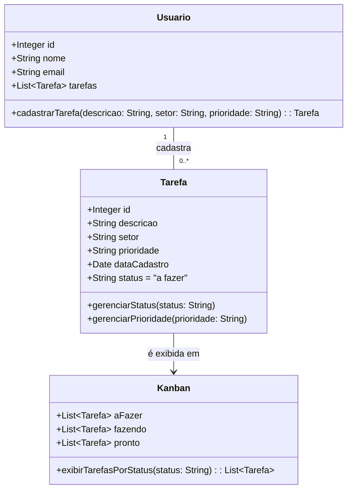
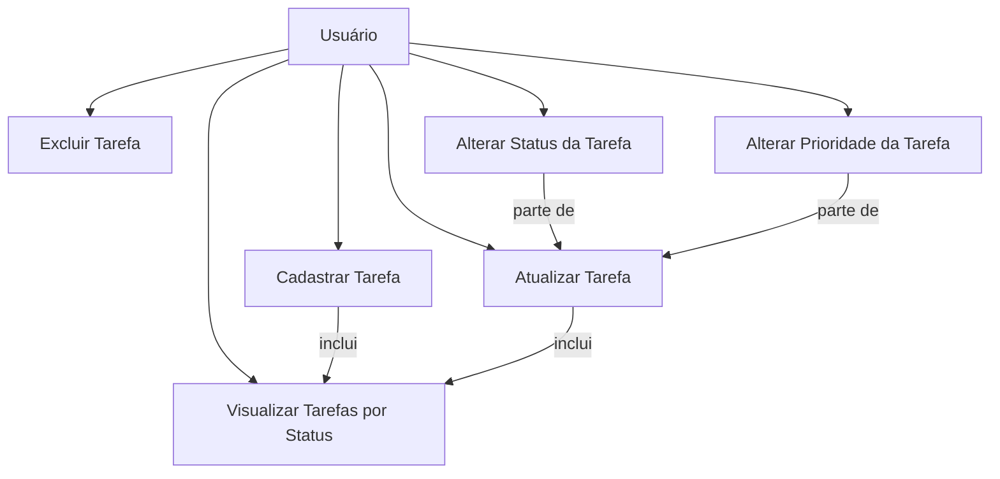

</a>
### Contexto Inicial
**Indústria do Ramo Alimentício:**
Uma indústria, do ramo alimentício, gerencia tarefas de seus setores utilizando o **kanban**. Não foi realizado um mapeamento do fluxo de cada setor, apenas é feito o controle das tarefas em modelo
simplificado como o **to do list**, onde as etapas são divididas em: a fazer, fazendo e pronto.
O kanban foi utilizado por compartilhar as informações de forma visual, aumentando a transparência e permitindo que toda equipe do setor fique ciente das tarefas. Porém, a necessidade da empresa é aumentar a visibilidade das tarefas e integrar as informações entre todos os setores.

 
 
 

   

   
  
  

 
   

</a>

## Apresentação do Projeto: Desenvolvimento de Gerenciamento de Tarefas com Node.js e Next

### Visão Geral do Projeto
**Objetivo:**
Desenvolver uma aplicação web sobre um gerenciamento de `tarefas` e de `usuarios`, na qual os usuários poderão criar, votar e acompanhar os resultados. Nós utilizaremos tecnologias modernas e práticas de mercado, garantindo segurança, escalabilidade e uma experiência de usuário fluida por meio do React, Next, Node.js, MongoDB, e JWT, criando uma aplicação completa e funcional que pode ser utilizada no mundo real.

**Por Que Este Projeto?**
A nossa empresa, dedicada a inovar no campo da interação digital, está em processo de criação de uma plataforma de enquetes interativas chamada `Votefy`. Esse projeto visa proporcionar uma experiência envolvente e dinâmica para os usuários, permitindo que eles participem e criem enquetes de maneira intuitiva e interativa. Com o objetivo de transformar a forma como as pessoas coletam e analisam opiniões, estamos desenvolvendo uma solução tecnológica avançada que ofereça uma interface amigável e funcionalidades robustas. 
     
</a>

A plataforma de enquetes será desenvolvida utilizando `Node.js` para o backend e `React e Next.js` para o frontend, com `MongoDB` como banco de dados e `JWT` para autenticação. A solução visa proporcionar uma experiência de usuário intuitiva, com recursos para criação, visualização, atualização e exclusão de enquetes.
     

</a>

     

</a>

